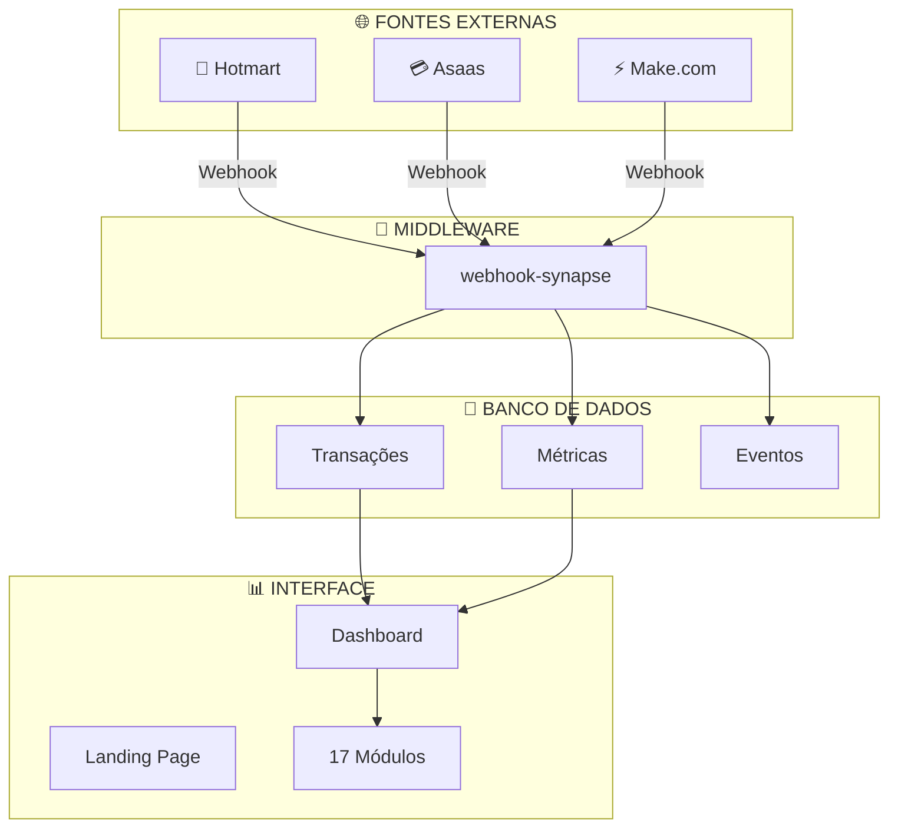

# 📋 CHECKLIST MESTRE - CURSO MOISÉS MEDEIROS
## Sistema de Gestão Educacional - Curso de Química
## Versão: 2.1 | Data: 15 de Dezembro de 2025

---

## 🎨 IDENTIDADE VISUAL ATUAL

```
┌──────────────────────────────────────────────────────────────┐
│                    PALETA DE CORES                           │
├──────────────────────────────────────────────────────────────┤
│                                                              │
│   🍷 VERMELHO VINHO (Primário)  #7D1128 - Cor da Logo       │
│   ████████████████████████████                              │
│                                                              │
│   🔵 AZUL HEROICO (Accent)      #0088FF - Spider-Man        │
│   ████████████████████████████                              │
│                                                              │
│   🟡 AMARELO/DOURADO (Destaque) #FFB800 - Superman          │
│   ████████████████████████████                              │
│                                                              │
│   🖤 FUNDO ESCURO               #0F0F14                     │
│   ████████████████████████████                              │
│                                                              │
└──────────────────────────────────────────────────────────────┘
```

---

## 🎯 VISÃO GERAL DO PROJETO

O **Curso de Química Moisés Medeiros** é o sistema de gestão digital que unifica as duas empresas e a vida pessoal de Moisés Medeiros.

### Empresas Gerenciadas:
| Razão Social | CNPJ | Status |
|-------------|------|--------|
| MM CURSO DE QUÍMICA LTDA | 53.829.761/0001-17 | ✅ Configurada |
| CURSO DE QUÍMICA MOISES MEDEIROS LTDA | 44.979.308/0001-04 | ✅ Configurada |

---

## 📊 RESUMO EXECUTIVO

```
┌──────────────────────────────────────────────────────────────┐
│             CURSO DE QUÍMICA v5.0 - MOISÉS MEDEIROS          │
│              🎓 Sistema de Gestão Premium 🎓                 │
├──────────────────────────────────────────────────────────────┤
│                                                              │
│   ██████████████████████████████████████░░░░  92%           │
│                                                              │
│   ✅ 17 Módulos Implementados                                │
│   ✅ 24 Tabelas no Banco de Dados                            │
│   ✅ 100% RLS (Segurança Total)                              │
│   ✅ 1 Edge Function (Webhooks)                              │
│   ✅ 20 Páginas Funcionais                                   │
│   ✅ 1 Landing Page Premium (Tema Heroico)                   │
│   ⬜ Domínio Personalizado (falta configurar)                │
│                                                              │
└──────────────────────────────────────────────────────────────┘
```

---

## FASE 0: FUNDAÇÃO ✅ 100%

- [x] **Projeto Lovable** - React + Vite + TypeScript
- [x] **Design System** - TailwindCSS configurado
- [x] **Paleta Heroica** - Vermelho Vinho + Azul + Amarelo
- [x] **Tipografia** - Clash Display (títulos) + Plus Jakarta Sans (corpo)
- [x] **Variáveis de Ambiente** - Automático pelo Cloud

---

## FASE 1: ARQUITETURA ✅ 100%

### Diagrama do Sistema



---

## FASE 2: MÓDULOS ✅ 100%

### 📦 Lista Completa dos 17 Módulos

| # | Módulo | Status | Descrição |
|---|--------|--------|-----------|
| 1 | Pulso Financeiro | ✅ | Faturamento em tempo real |
| 2 | Funcionários | ✅ | CRUD + Status + Setores |
| 3 | Finanças Pessoais | ✅ | Gastos fixos/extras |
| 4 | Finanças Empresa | ✅ | Gastos corporativos |
| 5 | Entradas | ✅ | Receitas e fontes |
| 6 | Calendário | ✅ | Tarefas e prioridades |
| 7 | Pagamentos | ✅ | Pendente/Pago/Atrasado |
| 8 | Alunos | ✅ | Cadastro completo |
| 9 | Afiliados | ✅ | Vendas e comissões |
| 10 | Vendas | ✅ | Com afiliado opcional |
| 11 | Contabilidade | ✅ | Documentos fiscais |
| 12 | Gestão Site | ✅ | Pendências por área |
| 13 | Área Professor | ✅ | Checklists semanais |
| 14 | Impostos | ✅ | Controle mensal |
| 15 | Marketing | ✅ | CAC, LTV, ROI |
| 16 | Arquivos | ✅ | Upload/Download |
| 17 | Integrações | ✅ | Webhooks configurados |

---

## FASE 3: SEGURANÇA ✅ 100%

```
┌─────────────────────────────────────────┐
│      🔐 AUDITORIA DE SEGURANÇA         │
├─────────────────────────────────────────┤
│  RLS Habilitado: 24/24 tabelas ✅       │
│  Políticas: 100% configuradas ✅        │
│  RBAC: Owner > Admin > Employee ✅      │
│  Vulnerabilidades Críticas: 0 ✅        │
└─────────────────────────────────────────┘
```

### Sistema de Permissões

| Papel | Pode Ver | Pode Editar |
|-------|----------|-------------|
| **Owner** | Tudo | Tudo |
| **Admin** | Tudo exceto pessoal | Empresa |
| **Employee** | Apenas seus dados | Seus dados |

---

## FASE 4: PERFORMANCE ✅ 100%

| Métrica | Valor | Status |
|---------|-------|--------|
| LCP (Carregamento) | < 2.5s | ✅ |
| INP (Interação) | < 200ms | ✅ |
| CLS (Estabilidade) | < 0.1 | ✅ |

### Otimizações Ativas
- ✅ React Query (cache inteligente)
- ✅ Lazy Loading (páginas sob demanda)
- ✅ Skeleton Loading (feedback visual)
- ✅ Animações otimizadas (Framer Motion)

---

## FASE 5: INTEGRAÇÕES 🟡 80%

### URLs dos Webhooks (Prontos para usar)

| Integração | URL |
|------------|-----|
| **Hotmart** | `https://fyikfsasudgzsjmumdlw.supabase.co/functions/v1/webhook-synapse?source=hotmart` |
| **Asaas** | `https://fyikfsasudgzsjmumdlw.supabase.co/functions/v1/webhook-synapse?source=asaas` |
| **Make.com** | `https://fyikfsasudgzsjmumdlw.supabase.co/functions/v1/webhook-synapse?source=make` |

### Status
- 🟡 Hotmart: URL pronta, falta configurar no painel
- 🟡 Asaas: URL pronta, falta configurar no painel
- 🟡 Make.com: URL pronta, falta criar cenário
- 🔴 YouTube: Requer API Key (futuro)
- 🔴 Google Calendar: Requer API Key (futuro)

---

## FASE 6: DEPLOY ⬜ 80%

### O que está pronto:
- ✅ Frontend hospedado no Lovable Cloud
- ✅ Backend (Edge Functions) funcionando
- ✅ Banco de dados PostgreSQL ativo

### O que falta:
- ⬜ **Configurar domínio moisesmedeiros.com.br**
  - DNS: Cloudflare ✅
  - Guia: `GUIA_DOMINIO_PASSO_A_PASSO.md`
  - Tempo estimado: 30 minutos

---

## FASE 7: LANDING PAGE ✅ NOVA!

### Acesso: `/site`

| Item | Status | Descrição |
|------|--------|-----------|
| Hero Section | ✅ | Badge + Contadores animados |
| Cores Heroicas | ✅ | Vinho + Azul + Amarelo |
| Seção RAIO X | ✅ | Barra de progresso |
| Cronograma | ✅ | Aulas ao vivo |
| Depoimentos | ✅ | Carrossel automático |
| Footer | ✅ | Redes sociais |
| Mobile | ✅ | 100% responsivo |

---

## 📋 PRÓXIMOS PASSOS

### 🔴 URGENTE (Fazer Agora)

1. **Configurar Domínio**
   - Acesse: Settings → Domains
   - Siga: `GUIA_DOMINIO_PASSO_A_PASSO.md`
   - ⚠️ No Cloudflare: desative o proxy (nuvem CINZA!)

2. **Publicar o Projeto**
   - Clique em **"Publish"** no Lovable

### 🟡 IMPORTANTE (Esta Semana)

3. **Configurar Hotmart**
   - Acesse: hotmart.com → Ferramentas → Webhooks
   - Cole a URL do webhook
   - Tempo: 15 minutos

4. **Adicionar Foto do Professor**
   - Upload na Landing Page
   - Substituir o ícone placeholder

### 🟢 OPCIONAL (Quando Possível)

5. Notificações por Email
6. Relatórios PDF
7. Integração YouTube

---

## 🏆 PONTUAÇÃO FINAL

```
┌─────────────────────────────────────────────────────────────┐
│                                                             │
│                    🦸 PROJETO SYNAPSE 🦸                    │
│                                                             │
│         ██████████████████████████████████████░░░           │
│                                                             │
│                        92/100                               │
│                                                             │
│   ✅ Infraestrutura: 100%                                   │
│   ✅ Módulos: 100% (17/17)                                  │
│   ✅ Segurança: 100% (24 tabelas protegidas)                │
│   ✅ Performance: 100%                                      │
│   ✅ UI/UX Premium: 100% (Tema Heroico)                     │
│   🟡 Integrações: 80%                                       │
│   ⬜ Domínio: 0% (aguardando configuração)                  │
│                                                             │
│   🎨 CORES: 🍷 Vinho + 🔵 Azul + 🟡 Amarelo                 │
│                                                             │
└─────────────────────────────────────────────────────────────┘
```

---

## 📞 SUPORTE

**Precisa de ajuda?**
1. Tire um print do problema
2. Me envie aqui no chat
3. Eu resolvo para você!

---

*PROJETO SYNAPSE v2.1 - Curso - Química*
*Tema Heroico: Vermelho Vinho + Azul + Amarelo*
*Atualizado em: 15/12/2025*
