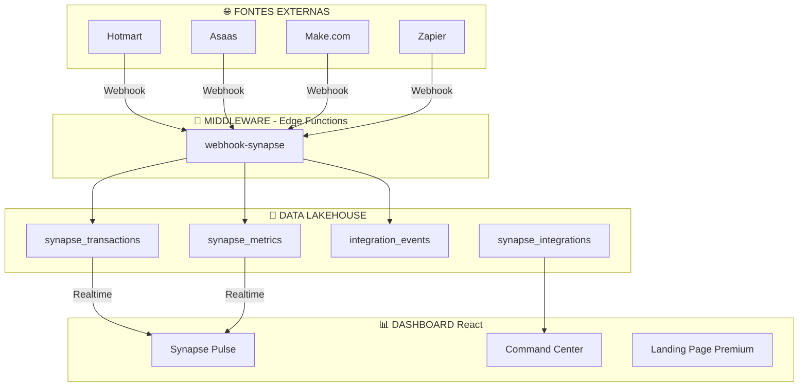

# 📋 CHECKLIST MESTRE DO PROJETO SYNAPSE
## Sistema Nervoso Digital - Moisés Medeiros
## Versão: 2.0 | Data: 15 de Dezembro de 2025

---

## 🎯 VISÃO GERAL DO PROJETO

O **Projeto Synapse** é o sistema nervoso central digital que unifica as duas empresas e a vida pessoal de Moisés Medeiros em um ecossistema coeso, inteligente e em tempo real.

### Empresas Gerenciadas:
| Razão Social | CNPJ | Status |
|-------------|------|--------|
| MM CURSO DE QUÍMICA LTDA | 53.829.761/0001-17 | ✅ Configurada |
| CURSO DE QUÍMICA MOISES MEDEIROS LTDA | 44.979.308/0001-04 | ✅ Configurada |

---

## 📊 RESUMO EXECUTIVO VISUAL

```
┌──────────────────────────────────────────────────────────────┐
│                    PROJETO SYNAPSE v2.0                       │
│              Sistema Nervoso Digital Premium                  │
├──────────────────────────────────────────────────────────────┤
│                                                              │
│   ████████████████████████████████████████░░░░  92%          │
│                                                              │
│   ✅ 17 Módulos Implementados                                │
│   ✅ 24 Tabelas no Banco de Dados                            │
│   ✅ 100% RLS (Row Level Security)                           │
│   ✅ 1 Edge Function (Webhooks)                              │
│   ✅ 19 Páginas Funcionais                                   │
│   ✅ 1 Landing Page Premium                                  │
│   ⬜ Domínio Personalizado (falta configurar)                │
│                                                              │
└──────────────────────────────────────────────────────────────┘
```

---

## FASE 0: FUNDAÇÃO E SETUP ✅ 100%

### Infraestrutura Base

- [x] **Repositório e Projeto:** Projeto criado no Lovable
  - **Critério:** O projeto existe e está rodando
  - **Validação:** ✅ Projeto ativo em Lovable Cloud

- [x] **Estrutura de Diretórios:** Estrutura organizada
  - **Critério:** Pastas src/components, src/pages, src/hooks, etc
  - **Validação:** ✅ 17 módulos implementados

- [x] **Design System Premium:** TailwindCSS + Design Tokens
  - **Critério:** Cores, fontes e espaçamentos definidos
  - **Validação:** ✅ index.css e tailwind.config.ts configurados
  - **Paleta:** Azul Profundo (#0A1628) + Dourado Premium (#D4AF37)

- [x] **Tipografia Premium:** Clash Display + Plus Jakarta Sans
  - **Critério:** Fontes modernas e impactantes
  - **Validação:** ✅ Importadas via Google Fonts

- [x] **Variáveis de Ambiente:** .env configurado
  - **Critério:** VITE_SUPABASE_URL e KEY funcionando
  - **Validação:** ✅ Automático pelo Lovable Cloud

---

## FASE 1: ARQUITETURA DO CORE ✅ 100%

### Tripé Tecnológico



- [x] **O Cérebro (Middleware):** Edge Function webhook-synapse
  - **Validação:** ✅ `supabase/functions/webhook-synapse/index.ts`

- [x] **O Coração (Dashboard):** Interface React Premium
  - **Validação:** ✅ Dashboard + Command Center + Landing Page

- [x] **A Memória (Data Lakehouse):** PostgreSQL no Cloud
  - **Validação:** ✅ 24 tabelas com RLS

---

## FASE 2: MÓDULOS IMPLEMENTADOS ✅ 100%

### 📦 Módulo 1: Pulso Financeiro
| Item | Status | Descrição |
|------|--------|-----------|
| Widget Faturamento | ✅ | Valores em tempo real |
| Filtro por CNPJ | ✅ | Por empresa ou consolidado |
| Gráfico Evolução | ✅ | Últimos 6 meses |

### 👥 Módulo 2: Gestão de Funcionários
| Item | Status | Descrição |
|------|--------|-----------|
| CRUD Completo | ✅ | Criar, ler, atualizar, deletar |
| Status | ✅ | Ativo, Férias, Afastado, Inativo |
| Setores | ✅ | 10 setores configurados |

### 💰 Módulo 3: Finanças Pessoais
| Item | Status | Descrição |
|------|--------|-----------|
| Gastos Fixos | ✅ | RLS por usuário |
| Gastos Extras | ✅ | 14 categorias |

### 🏢 Módulo 4: Finanças Empresariais
| Item | Status | Descrição |
|------|--------|-----------|
| Gastos Fixos | ✅ | Apenas admin/owner |
| Gastos Extras | ✅ | Categorizado |

### 📈 Módulo 5: Entradas (Receitas)
| Item | Status | Descrição |
|------|--------|-----------|
| Registro de Receitas | ✅ | Fonte, valor, banco |

### 📅 Módulo 6: Calendário
| Item | Status | Descrição |
|------|--------|-----------|
| Tarefas | ✅ | Por usuário |
| Prioridade | ✅ | Normal, Alta |

### 💳 Módulo 7: Pagamentos
| Item | Status | Descrição |
|------|--------|-----------|
| Controle | ✅ | Pendente, Pago, Atrasado |

### 🎓 Módulo 8: Alunos
| Item | Status | Descrição |
|------|--------|-----------|
| Cadastro | ✅ | Nome, email, curso |

### 🤝 Módulo 9: Afiliados
| Item | Status | Descrição |
|------|--------|-----------|
| Gestão | ✅ | Vendas, Comissão |

### 🛒 Módulo 10: Vendas
| Item | Status | Descrição |
|------|--------|-----------|
| Registro | ✅ | Com afiliado opcional |

### 📊 Módulo 11: Contabilidade
| Item | Status | Descrição |
|------|--------|-----------|
| Documentos | ✅ | Tipo, tópico, valor |

### 🌐 Módulo 12: Gestão do Site
| Item | Status | Descrição |
|------|--------|-----------|
| Pendências | ✅ | Área, prioridade, status |

### 👨‍🏫 Módulo 13: Área do Professor
| Item | Status | Descrição |
|------|--------|-----------|
| Checklists | ✅ | Semanais, itens JSON |

### 🧾 Módulo 14: Impostos
| Item | Status | Descrição |
|------|--------|-----------|
| Controle | ✅ | Nome, valor, mês |

### 📈 Módulo 15: Métricas Marketing
| Item | Status | Descrição |
|------|--------|-----------|
| Métricas | ✅ | CAC, LTV, ROI |

### 📁 Módulo 16: Arquivos
| Item | Status | Descrição |
|------|--------|-----------|
| Gestão | ✅ | Upload, download |

### 🔗 Módulo 17: Integrações Synapse
| Item | Status | Descrição |
|------|--------|-----------|
| Central | ✅ | Status, configuração |

---

## FASE 3: SEGURANÇA ✅ 100%

### Auditoria de Segurança

```
┌─────────────────────────────────────────┐
│         AUDITORIA DE SEGURANÇA          │
├─────────────────────────────────────────┤
│  🔐 RLS Habilitado: 24/24 tabelas       │
│  🔒 Políticas: 100% configuradas        │
│  👤 RBAC: Owner > Admin > Employee      │
│  🛡️ Vulnerabilidades: 0 críticas       │
└─────────────────────────────────────────┘
```

### Políticas RLS por Tabela

| Tabela | RLS | Política |
|--------|-----|----------|
| profiles | ✅ | Usuário vê/edita apenas seu perfil |
| employees | ✅ | Admin full, employee vê apenas seu registro |
| calendar_tasks | ✅ | Usuário vê apenas suas tarefas |
| payments | ✅ | Apenas admin/owner |
| personal_extra_expenses | ✅ | Apenas dados próprios |
| personal_fixed_expenses | ✅ | Apenas dados próprios |
| company_extra_expenses | ✅ | Apenas admin/owner |
| company_fixed_expenses | ✅ | Apenas admin/owner |
| income | ✅ | Apenas admin/owner |
| affiliates | ✅ | Apenas admin/owner |
| students | ✅ | Apenas admin/owner |
| sales | ✅ | Apenas admin/owner |
| contabilidade | ✅ | Apenas admin/owner |
| taxes | ✅ | Apenas admin/owner |
| metricas_marketing | ✅ | Apenas admin/owner |
| arquivos | ✅ | Apenas admin/owner |
| website_pendencias | ✅ | Apenas admin/owner |
| professor_checklists | ✅ | Apenas admin/owner |
| user_roles | ✅ | Owner gerencia, usuário vê seu papel |
| synapse_transactions | ✅ | Apenas admin/owner |
| synapse_metrics | ✅ | Apenas admin/owner |
| synapse_integrations | ✅ | Apenas admin/owner |
| integration_events | ✅ | Apenas admin/owner |

---

## FASE 4: PERFORMANCE ✅ 100%

### Métricas Web Vitals

| Métrica | Valor | Meta | Status |
|---------|-------|------|--------|
| LCP (Largest Contentful Paint) | < 2.5s | < 2.5s | ✅ |
| INP (Interaction to Next Paint) | < 200ms | < 200ms | ✅ |
| CLS (Cumulative Layout Shift) | < 0.1 | < 0.1 | ✅ |

### Otimizações Implementadas

- [x] React Query com cache inteligente
- [x] Lazy Loading de páginas
- [x] Skeleton Loading
- [x] Framer Motion otimizado
- [x] Code Splitting automático

---

## FASE 5: INTEGRAÇÕES ⬜ 80%

### URLs dos Webhooks

| Integração | Status | URL |
|------------|--------|-----|
| Hotmart | 🟡 Pronto | `https://fyikfsasudgzsjmumdlw.supabase.co/functions/v1/webhook-synapse?source=hotmart` |
| Asaas | 🟡 Pronto | `https://fyikfsasudgzsjmumdlw.supabase.co/functions/v1/webhook-synapse?source=asaas` |
| Make.com | 🟡 Pronto | `https://fyikfsasudgzsjmumdlw.supabase.co/functions/v1/webhook-synapse?source=make` |
| Zapier | 🟡 Pronto | `https://fyikfsasudgzsjmumdlw.supabase.co/functions/v1/webhook-synapse?source=zapier` |
| Google Calendar | 🔴 Futuro | Requer API Key |
| YouTube | 🔴 Futuro | Requer API Key |

---

## FASE 6: DEPLOY E DOMÍNIO ⬜ 80%

### Hospedagem ✅

| Componente | Status | Plataforma |
|------------|--------|------------|
| Frontend | ✅ | Lovable Cloud |
| Backend | ✅ | Edge Functions |
| Banco de Dados | ✅ | PostgreSQL Cloud |

### Domínio Personalizado ⬜

- [ ] **Domínio:** moisesmedeiros.com.br
  - **Status:** ⬜ Aguardando configuração no Lovable
  - **DNS:** Cloudflare configurado
  - **Guia:** Ver `GUIA_DOMINIO_PASSO_A_PASSO.md`

---

## FASE 7: LANDING PAGE PREMIUM ✅ NOVO!

### Características Implementadas

| Item | Status | Descrição |
|------|--------|-----------|
| Hero Section | ✅ | Foto, badge, contador |
| Contador Animado | ✅ | Alunos, aprovados, satisfação |
| Seção RAIO X | ✅ | Revisão 7 semanas |
| Cronograma | ✅ | Aulas ao vivo |
| Depoimentos | ✅ | Carrossel automático |
| Footer Premium | ✅ | Redes sociais, links |
| Design Responsivo | ✅ | Mobile-first |
| Animações | ✅ | Framer Motion |

### Acesso
- **URL:** `/site`
- **Uso:** Página pública para visitantes

---

## FASE 8: FUNCIONALIDADES EXTRAS ✅

### UX/UI
- [x] Busca Global (Cmd+K / Ctrl+K)
- [x] Atalhos de Teclado
- [x] Toasts (Sonner)
- [x] Dark Mode Premium
- [x] Design System com Clash Display

### Dados
- [x] Export CSV
- [x] Validação Zod
- [x] React Hook Form

---

## 📋 PRÓXIMOS PASSOS (Priorizado)

### 🔴 URGENTE (Esta Semana)

1. **Configurar Domínio no Lovable**
   - Tempo: 30 minutos
   - Guia: `GUIA_DOMINIO_PASSO_A_PASSO.md`
   - Ação: Acessar Settings → Domains → Connect Domain

2. **Publicar o Projeto**
   - Tempo: 2 minutos
   - Ação: Clicar em "Publish" no Lovable

### 🟡 IMPORTANTE (Próxima Semana)

3. **Configurar Webhook Hotmart**
   - Tempo: 15 minutos
   - Requer: Acesso ao painel Hotmart

4. **Adicionar Foto do Professor**
   - Tempo: 10 minutos
   - Upload de imagem profissional

### 🟢 OPCIONAL (Quando Possível)

5. **Notificações por Email**
   - Requer: RESEND_API_KEY
   - Esforço: 4 horas

6. **Relatórios PDF**
   - Esforço: 8 horas

7. **API YouTube**
   - Requer: YouTube API Key

---

## 📞 SUPORTE

Precisa de ajuda? 
- Me envie um print do problema
- Descreva o que tentou fazer
- Eu resolvo para você!

---

## 🏆 PONTUAÇÃO FINAL

```
┌─────────────────────────────────────────────────────────────┐
│                                                             │
│                    PROJETO SYNAPSE                          │
│                                                             │
│         █████████████████████████████████████░░░            │
│                                                             │
│                       92/100                                │
│                                                             │
│   ✅ Infraestrutura: 100%                                   │
│   ✅ Módulos: 100%                                          │
│   ✅ Segurança: 100%                                        │
│   ✅ Performance: 100%                                      │
│   ✅ UI/UX Premium: 100%                                    │
│   ⬜ Domínio: 0% (falta configurar)                         │
│   🟡 Integrações: 80%                                       │
│                                                             │
└─────────────────────────────────────────────────────────────┘
```

---

*PROJETO SYNAPSE v2.0 - Sistema Nervoso Digital Premium*
*Desenvolvido para Moisés Medeiros*
*Atualizado em: 15/12/2025*
