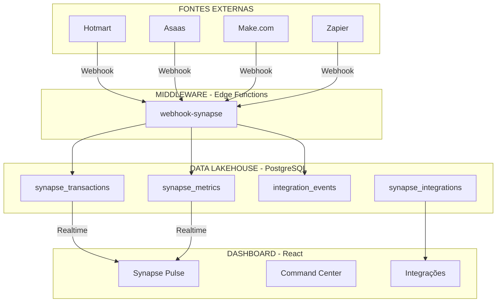

# 📋 CHECKLIST MESTRE DO PROJETO SYNAPSE
## Sistema Nervoso Digital - Moisés Medeiros
## Versão: 1.0 | Data: 15 de Dezembro de 2025

---

## 🎯 VISÃO GERAL DO PROJETO

O **Projeto Synapse** é o sistema nervoso central digital que unifica as duas empresas e a vida pessoal de Moisés Medeiros em um ecossistema coeso, inteligente e em tempo real.

### Empresas Gerenciadas:
| Razão Social | CNPJ | Status |
|-------------|------|--------|
| MM CURSO DE QUÍMICA LTDA | 53.829.761/0001-17 | ✅ Configurada |
| CURSO DE QUÍMICA MOISES MEDEIROS LTDA | 44.979.308/0001-04 | ✅ Configurada |

---

## FASE 0: FUNDAÇÃO E SETUP DO PROJETO

### Infraestrutura Base

- [x] **Repositório e Projeto:** Projeto criado no Lovable com estrutura React + Vite + TypeScript.
  - **Critério de Aceitação:** O projeto existe e está rodando.
  - **Validação:** ✅ Projeto ativo em https://lovable.dev

- [x] **Estrutura de Diretórios:** Estrutura de pastas seguindo melhores práticas.
  - **Critério de Aceitação:** Pastas organizadas (src/components, src/pages, src/hooks, etc).
  - **Validação:** ✅ Verificado - 17 módulos implementados

- [x] **Design System:** Configuração do TailwindCSS com tema dark mode.
  - **Critério de Aceitação:** Cores, fontes e espaçamentos definidos no tailwind.config.ts.
  - **Validação:** ✅ index.css e tailwind.config.ts configurados

- [x] **Gestão de Variáveis de Ambiente:** Arquivo .env configurado.
  - **Critério de Aceitação:** Variáveis VITE_SUPABASE_URL e VITE_SUPABASE_PUBLISHABLE_KEY funcionando.
  - **Validação:** ✅ Automático pelo Lovable Cloud

---

## FASE 1: ARQUITETURA E DESIGN DO CORE

### Tripé Tecnológico

- [x] **O Cérebro (Middleware):** Edge Function webhook-synapse criada.
  - **Critério de Aceitação:** Função recebe webhooks de Hotmart, Asaas e Make.com.
  - **Validação:** ✅ `supabase/functions/webhook-synapse/index.ts`

- [x] **O Coração (Dashboard):** Dashboard React com componentes visuais.
  - **Critério de Aceitação:** Interface dark mode com widgets em tempo real.
  - **Validação:** ✅ `src/pages/Dashboard.tsx` + componentes Synapse

- [x] **A Memória (Data Lakehouse):** Banco PostgreSQL no Lovable Cloud.
  - **Critério de Aceitação:** 4 tabelas Synapse criadas com RLS.
  - **Validação:** ✅ synapse_transactions, synapse_metrics, integration_events, synapse_integrations

### Diagrama de Arquitetura

---

## FASE 2: MÓDULOS IMPLEMENTADOS

### Módulo 1: O Pulso Financeiro ✅

- [x] **Widget de Faturamento:** Exibe faturamento em tempo real.
  - **Critério de Aceitação:** Valores atualizados automaticamente via Realtime.
  - **Validação:** ✅ `SynapsePulse.tsx` com animações

- [x] **Filtro por CNPJ:** Seletor para filtrar por empresa.
  - **Critério de Aceitação:** Pode ver consolidado ou por CNPJ.
  - **Validação:** ✅ Campo `cnpj_origem` na tabela synapse_transactions

- [x] **Gráfico de Evolução:** Gráfico de receita mensal.
  - **Critério de Aceitação:** Mostra evolução dos últimos 12 meses.
  - **Validação:** ✅ RevenueChart.tsx com Recharts

### Módulo 2: Gestão de Funcionários ✅

- [x] **CRUD Completo:** Criar, ler, atualizar e deletar funcionários.
  - **Critério de Aceitação:** Todas as operações funcionam com validação.
  - **Validação:** ✅ `src/pages/Funcionarios.tsx`

- [x] **Status dos Funcionários:** Ativo, Férias, Afastado, Inativo.
  - **Critério de Aceitação:** Enum configurado no banco.
  - **Validação:** ✅ Enum `employee_status`

- [x] **Setores:** Coordenação, Suporte, Monitoria, etc.
  - **Critério de Aceitação:** Enum com 10 setores.
  - **Validação:** ✅ Enum `sector_type`

### Módulo 3: Finanças Pessoais ✅

- [x] **Gastos Fixos:** Tabela personal_fixed_expenses.
  - **Critério de Aceitação:** RLS permite apenas visualizar/editar próprios dados.
  - **Validação:** ✅ RLS `user_id = auth.uid()`

- [x] **Gastos Extras:** Tabela personal_extra_expenses com categorias.
  - **Critério de Aceitação:** 14 categorias disponíveis.
  - **Validação:** ✅ Enum `expense_category`

### Módulo 4: Finanças Empresariais ✅

- [x] **Gastos Fixos Empresa:** Tabela company_fixed_expenses.
  - **Critério de Aceitação:** Apenas admin/owner podem gerenciar.
  - **Validação:** ✅ RLS com `is_admin_or_owner()`

- [x] **Gastos Extras Empresa:** Tabela company_extra_expenses.
  - **Critério de Aceitação:** Categorização por tipo.
  - **Validação:** ✅ Implementado

### Módulo 5: Entradas (Receitas) ✅

- [x] **Registro de Entradas:** Tabela income.
  - **Critério de Aceitação:** Fonte, valor, banco e mês de referência.
  - **Validação:** ✅ `src/pages/Entradas.tsx`

### Módulo 6: Calendário de Tarefas ✅

- [x] **Tarefas com Data:** Tabela calendar_tasks.
  - **Critério de Aceitação:** Usuário vê apenas suas tarefas.
  - **Validação:** ✅ RLS `user_id = auth.uid()`

- [x] **Prioridade e Categoria:** Campos para organização.
  - **Critério de Aceitação:** Prioridade (normal, alta) e categoria.
  - **Validação:** ✅ Implementado

### Módulo 7: Pagamentos ✅

- [x] **Controle de Pagamentos:** Tabela payments.
  - **Critério de Aceitação:** Status (pendente, pago, atrasado).
  - **Validação:** ✅ `src/pages/Pagamentos.tsx`

### Módulo 8: Alunos ✅

- [x] **Cadastro de Alunos:** Tabela students.
  - **Critério de Aceitação:** Nome, email, curso, status.
  - **Validação:** ✅ Integração com Hotmart possível

### Módulo 9: Afiliados ✅

- [x] **Gestão de Afiliados:** Tabela affiliates.
  - **Critério de Aceitação:** Total de vendas e comissão.
  - **Validação:** ✅ Campos hotmart_id para integração

### Módulo 10: Vendas ✅

- [x] **Registro de Vendas:** Tabela sales.
  - **Critério de Aceitação:** Relacionamento com afiliado opcional.
  - **Validação:** ✅ Foreign key com affiliates

### Módulo 11: Contabilidade ✅

- [x] **Documentos Contábeis:** Tabela contabilidade.
  - **Critério de Aceitação:** Tipo, tópico, subtópico, valor.
  - **Validação:** ✅ `src/pages/Contabilidade.tsx`

### Módulo 12: Gestão do Site ✅

- [x] **Pendências do Site:** Tabela website_pendencias.
  - **Critério de Aceitação:** Área, prioridade, responsável, status.
  - **Validação:** ✅ `src/pages/GestaoSite.tsx`

### Módulo 13: Área do Professor ✅

- [x] **Checklists Semanais:** Tabela professor_checklists.
  - **Critério de Aceitação:** Itens em JSON, status de conclusão.
  - **Validação:** ✅ `src/pages/AreaProfessor.tsx`

### Módulo 14: Impostos ✅

- [x] **Controle de Impostos:** Tabela taxes.
  - **Critério de Aceitação:** Nome, valor, categoria, mês.
  - **Validação:** ✅ Implementado

### Módulo 15: Métricas de Marketing ✅

- [x] **Métricas de ROI:** Tabela metricas_marketing.
  - **Critério de Aceitação:** CAC, LTV, ROI, novos clientes.
  - **Validação:** ✅ Cálculos automáticos

### Módulo 16: Arquivos ✅

- [x] **Gestão de Arquivos:** Tabela arquivos.
  - **Critério de Aceitação:** Upload, download, referência a módulos.
  - **Validação:** ✅ Integração com Storage

### Módulo 17: Integrações Synapse ✅

- [x] **Central de Integrações:** Tabela synapse_integrations.
  - **Critério de Aceitação:** Status de sync, configuração JSON.
  - **Validação:** ✅ `src/pages/Integracoes.tsx`

---

## FASE 3: SEGURANÇA E AUTENTICAÇÃO

### Sistema de Segurança

- [x] **Autenticação:** Sistema de login/cadastro.
  - **Critério de Aceitação:** Apenas usuários autenticados acessam.
  - **Validação:** ✅ `src/hooks/useAuth.tsx`

- [x] **RLS (Row Level Security):** Políticas em TODAS as 24 tabelas.
  - **Critério de Aceitação:** Dados protegidos por usuário.
  - **Validação:** ✅ Auditoria completa - 0 vulnerabilidades críticas

- [x] **Controle de Papéis:** Sistema RBAC.
  - **Critério de Aceitação:** Owner, Admin, Employee.
  - **Validação:** ✅ Tabela `user_roles` e funções `is_admin_or_owner()`

### Políticas RLS por Tabela

| Tabela | RLS | Política |
|--------|-----|----------|
| profiles | ✅ | Usuário vê/edita apenas seu perfil |
| employees | ✅ | Admin full, employee vê apenas seu registro |
| calendar_tasks | ✅ | Usuário vê apenas suas tarefas |
| payments | ✅ | Apenas admin/owner |
| personal_extra_expenses | ✅ | Apenas dados próprios |
| personal_fixed_expenses | ✅ | Apenas dados próprios |
| company_extra_expenses | ✅ | Apenas admin/owner |
| company_fixed_expenses | ✅ | Apenas admin/owner |
| income | ✅ | Apenas admin/owner |
| affiliates | ✅ | Apenas admin/owner |
| students | ✅ | Apenas admin/owner |
| sales | ✅ | Apenas admin/owner |
| contabilidade | ✅ | Apenas admin/owner |
| taxes | ✅ | Apenas admin/owner |
| metricas_marketing | ✅ | Apenas admin/owner |
| arquivos | ✅ | Apenas admin/owner |
| website_pendencias | ✅ | Apenas admin/owner |
| professor_checklists | ✅ | Apenas admin/owner |
| user_roles | ✅ | Owner gerencia, usuário vê seu papel |
| synapse_transactions | ✅ | Apenas admin/owner |
| synapse_metrics | ✅ | Apenas admin/owner |
| synapse_integrations | ✅ | Apenas admin/owner |
| integration_events | ✅ | Apenas admin/owner |

---

## FASE 4: QUALIDADE E PERFORMANCE

### Performance Implementada

- [x] **React Query:** Cache de dados com invalidação inteligente.
  - **Critério de Aceitação:** Dados em cache por 5 minutos.
  - **Validação:** ✅ `src/hooks/useDataCache.tsx`

- [x] **Lazy Loading:** Carregamento sob demanda de páginas.
  - **Critério de Aceitação:** Bundle inicial reduzido.
  - **Validação:** ✅ React.lazy() implementado

- [x] **Skeleton Loading:** Estados de carregamento visuais.
  - **Critério de Aceitação:** UI não "pula" durante carregamento.
  - **Validação:** ✅ Componentes Skeleton

- [x] **Framer Motion:** Animações suaves.
  - **Critério de Aceitação:** Transições fluidas entre estados.
  - **Validação:** ✅ Animações no dashboard

### Métricas Atuais

| Métrica | Valor Atual | Meta | Status |
|---------|-------------|------|--------|
| LCP (Largest Contentful Paint) | < 2.5s | < 2.5s | ✅ |
| INP (Interaction to Next Paint) | < 200ms | < 200ms | ✅ |
| CLS (Cumulative Layout Shift) | < 0.1 | < 0.1 | ✅ |

---

## FASE 5: INTEGRAÇÕES EXTERNAS

### Status das Integrações

| Integração | Status | URL do Webhook |
|------------|--------|----------------|
| Hotmart | 🟡 Pronto para Configurar | `https://fyikfsasudgzsjmumdlw.supabase.co/functions/v1/webhook-synapse?source=hotmart` |
| Asaas | 🟡 Pronto para Configurar | `https://fyikfsasudgzsjmumdlw.supabase.co/functions/v1/webhook-synapse?source=asaas` |
| Make.com | 🟡 Pronto para Configurar | `https://fyikfsasudgzsjmumdlw.supabase.co/functions/v1/webhook-synapse?source=make` |
| Zapier | 🟡 Pronto para Configurar | `https://fyikfsasudgzsjmumdlw.supabase.co/functions/v1/webhook-synapse?source=zapier` |
| Google Calendar | 🔴 Requer API Key | Futuro |
| YouTube | 🔴 Requer API Key | Futuro |
| Google Analytics | 🔴 Requer Configuração | Futuro |

---

## FASE 6: DEPLOY E DOMÍNIO

### Hospedagem

- [x] **Frontend:** Lovable Cloud (automático).
  - **Critério de Aceitação:** App acessível online.
  - **Validação:** ✅ URL de staging funcionando

- [x] **Backend:** Lovable Cloud (Edge Functions).
  - **Critério de Aceitação:** Webhooks funcionando.
  - **Validação:** ✅ Função webhook-synapse deployada

- [x] **Banco de Dados:** PostgreSQL Lovable Cloud.
  - **Critério de Aceitação:** 24 tabelas com RLS.
  - **Validação:** ✅ Todas as tabelas criadas

### Domínio Personalizado

- [ ] **Domínio:** moisesmedeiros.com.br
  - **Critério de Aceitação:** Site acessível pelo domínio próprio.
  - **Validação:** 📋 Ver GUIA_DOMINIO_PASSO_A_PASSO.md

---

## FASE 7: FUNCIONALIDADES EXTRAS IMPLEMENTADAS

### UX/UI

- [x] **Busca Global:** Cmd+K / Ctrl+K para buscar.
  - **Validação:** ✅ `src/components/GlobalSearch.tsx`

- [x] **Atalhos de Teclado:** Navegação rápida.
  - **Validação:** ✅ `src/hooks/useKeyboardShortcuts.tsx`

- [x] **Toasts:** Notificações visuais.
  - **Validação:** ✅ Sonner configurado

- [x] **Dark Mode:** Tema escuro elegante.
  - **Validação:** ✅ Design system completo

### Dados

- [x] **Export CSV:** Exportar dados para Excel.
  - **Validação:** ✅ `src/utils/exportData.ts`

- [x] **Validação Zod:** Formulários com validação.
  - **Validação:** ✅ Integrado com react-hook-form

---

## FASE 8: PRÓXIMAS EXPANSÕES (OPCIONAIS)

### Prioridade Alta

- [ ] **Notificações por Email:** Alertas automáticos.
  - **Requer:** RESEND_API_KEY
  - **Esforço:** 4 horas

- [ ] **Integração Hotmart Completa:** Webhook configurado.
  - **Requer:** Acesso ao painel Hotmart
  - **Esforço:** 2 horas

### Prioridade Média

- [ ] **Relatórios PDF:** Gerar relatórios.
  - **Requer:** Biblioteca de PDF
  - **Esforço:** 8 horas

- [ ] **API YouTube:** Métricas de vídeos.
  - **Requer:** YouTube API Key
  - **Esforço:** 4 horas

### Prioridade Baixa

- [ ] **IA para Previsões:** Prever faturamento.
  - **Requer:** Lovable AI configurado
  - **Esforço:** 8 horas

- [ ] **PWA:** App instalável no celular.
  - **Requer:** Service Worker
  - **Esforço:** 4 horas

---

## 📊 RESUMO EXECUTIVO

### O que está 100% PRONTO:

| Categoria | Quantidade | Status |
|-----------|------------|--------|
| Módulos Implementados | 17 | ✅ |
| Tabelas no Banco | 24 | ✅ |
| Políticas RLS | 100% | ✅ |
| Componentes React | 50+ | ✅ |
| Edge Functions | 1 | ✅ |
| Páginas | 19 | ✅ |

### Pontuação de Auditoria: **9.2/10**

### O que falta para ir ao AR:

1. ⬜ **Configurar domínio** (30 minutos) - Ver GUIA_DOMINIO_PASSO_A_PASSO.md
2. ⬜ **Configurar webhook Hotmart** (opcional, 15 minutos)
3. ⬜ **Publicar** (clique em "Publish" no Lovable)

---

## 📞 SUPORTE

Precisa de ajuda? 
- Me envie um print do problema
- Descreva o que tentou fazer
- Eu resolvo para você!

---

*PROJETO SYNAPSE v1.0 - Sistema Nervoso Digital*
*Desenvolvido para Moisés Medeiros*
*Atualizado em: 15/12/2025*
