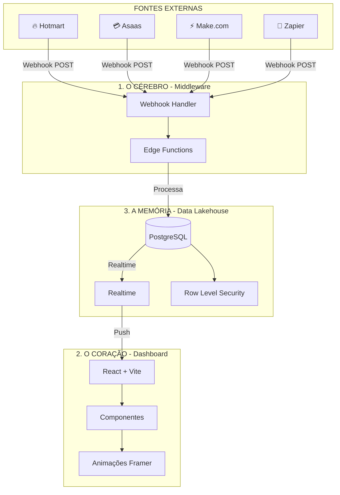

# 🧬 MOISÉS MEDEIROS - DOCUMENTAÇÃO COMPLETA
## Sistema de Gestão Educacional - Curso de Química
## Versão 8.0 FINAL | Atualizado em: 15/12/2025

---

## 📋 ÍNDICE

1. [Visão Geral](#visão-geral)
2. [Arquitetura do Sistema](#arquitetura-do-sistema)
3. [Módulos Implementados](#módulos-implementados)
4. [Integrações Externas](#integrações-externas)
5. [Segurança e RLS](#segurança-e-rls)
6. [Como Usar](#como-usar)
7. [Próximos Passos](#próximos-passos)

---

## 🎯 VISÃO GERAL

O **Sistema Moisés Medeiros** é a plataforma de gestão digital que unifica as operações do Curso de Química e a gestão empresarial em um ecossistema coeso, inteligente e em tempo real.

### Empresas Gerenciadas

| Razão Social | CNPJ | Nome Fantasia |
|-------------|------|---------------|
| MM CURSO DE QUÍMICA LTDA | 53.829.761/0001-17 | CURSO QUÍMICA MOISES |
| CURSO DE QUÍMICA MOISES MEDEIROS LTDA | 44.979.308/0001-04 | CURSO QUÍMICA MOISES MEDEIROS |

### O Que o Sistema Faz

✅ **Dashboard Unificado** - Visão 360° de todas as operações
✅ **Tempo Real** - Dados atualizados instantaneamente via webhooks
✅ **Multi-empresa** - Filtrar por CNPJ ou ver consolidado
✅ **Seguro** - RLS em todas as tabelas, autenticação obrigatória
✅ **Dark Mode** - Design elegante e profissional

---

## 🏗️ ARQUITETURA DO SISTEMA

### O Tripé Tecnológico



### Fluxo de Dados

```
1. ENTRADA (Webhook)
   Hotmart/Asaas → POST → webhook-synapse → Processa JSON

2. PROCESSAMENTO (Edge Function)
   Identifica fonte → Extrai dados → Valida → Enriquece

3. PERSISTÊNCIA (Banco)
   Salva em synapse_transactions → Atualiza synapse_metrics

4. VISUALIZAÇÃO (Dashboard)
   Realtime subscription → Atualiza SynapsePulse → Animação
```

---

## 📦 MÓDULOS IMPLEMENTADOS

### Tabelas do Banco de Dados (24 tabelas)

| # | Tabela | Descrição | RLS |
|---|--------|-----------|-----|
| 1 | `profiles` | Perfis de usuários | ✅ |
| 2 | `user_roles` | Papéis (owner, admin, employee) | ✅ |
| 3 | `employees` | Funcionários | ✅ |
| 4 | `calendar_tasks` | Tarefas do calendário | ✅ |
| 5 | `payments` | Pagamentos | ✅ |
| 6 | `personal_fixed_expenses` | Gastos fixos pessoais | ✅ |
| 7 | `personal_extra_expenses` | Gastos extras pessoais | ✅ |
| 8 | `company_fixed_expenses` | Gastos fixos empresa | ✅ |
| 9 | `company_extra_expenses` | Gastos extras empresa | ✅ |
| 10 | `income` | Entradas/Receitas | ✅ |
| 11 | `affiliates` | Afiliados | ✅ |
| 12 | `students` | Alunos | ✅ |
| 13 | `sales` | Vendas | ✅ |
| 14 | `contabilidade` | Documentos contábeis | ✅ |
| 15 | `taxes` | Impostos | ✅ |
| 16 | `metricas_marketing` | Métricas de marketing | ✅ |
| 17 | `arquivos` | Arquivos/documentos | ✅ |
| 18 | `website_pendencias` | Pendências do site | ✅ |
| 19 | `professor_checklists` | Checklists do professor | ✅ |
| 20 | `synapse_transactions` | Transações em tempo real | ✅ |
| 21 | `synapse_metrics` | Métricas diárias | ✅ |
| 22 | `synapse_integrations` | Configuração de integrações | ✅ |
| 23 | `integration_events` | Log de eventos/webhooks | ✅ |

### Páginas do Sistema (19 páginas)

| Página | Rota | Descrição |
|--------|------|-----------|
| Dashboard | `/` | Centro de comando com stats e gráficos |
| Calendário | `/calendario` | Tarefas com agenda |
| Funcionários | `/funcionarios` | CRUD de funcionários |
| Pagamentos | `/pagamentos` | Controle de pagamentos |
| Finanças Pessoais | `/financas-pessoais` | Gastos pessoais |
| Finanças Empresa | `/financas-empresa` | Gastos empresariais |
| Entradas | `/entradas` | Receitas e entradas |
| Afiliados | `/afiliados` | Gestão de afiliados |
| Alunos | `/alunos` | Cadastro de alunos |
| Contabilidade | `/contabilidade` | Documentos contábeis |
| Relatórios | `/relatorios` | Relatórios e métricas |
| Gestão do Site | `/gestao-site` | Pendências do site |
| Portal do Aluno | `/portal-aluno` | Área do aluno |
| Área do Professor | `/area-professor` | Checklists semanais |
| Gestão de Equipe | `/gestao-equipe` | Visão da equipe |
| Configurações | `/configuracoes` | Configurações do sistema |
| Integrações | `/integracoes` | Webhooks e conexões |
| Guia | `/guia` | Tutorial do sistema |
| Auth | `/auth` | Login/Cadastro |

---

## 🔌 INTEGRAÇÕES EXTERNAS

### URL do Webhook (ÚNICA)

```
https://fyikfsasudgzsjmumdlw.supabase.co/functions/v1/webhook-curso-quimica
```

### Como Configurar Cada Plataforma

#### 🔥 Hotmart

1. Acesse: **Hotmart → Ferramentas → Webhooks**
2. Clique em **"Adicionar Webhook"**
3. Cole a URL:
   ```
   https://fyikfsasudgzsjmumdlw.supabase.co/functions/v1/webhook-curso-quimica?source=hotmart
   ```
4. Selecione os eventos:
   - ✅ `PURCHASE_APPROVED` (venda aprovada)
   - ✅ `PURCHASE_REFUNDED` (reembolso)
   - ✅ `SUBSCRIPTION_CANCELED` (cancelamento)
5. Clique em **Salvar**

#### 💳 Asaas

1. Acesse: **Asaas → Integrações → Webhooks**
2. Clique em **"Adicionar"**
3. Cole a URL:
   ```
   https://fyikfsasudgzsjmumdlw.supabase.co/functions/v1/webhook-curso-quimica?source=asaas
   ```
4. Selecione os eventos:
   - ✅ `PAYMENT_RECEIVED`
   - ✅ `PAYMENT_CONFIRMED`
   - ✅ `PAYMENT_OVERDUE`
5. Clique em **Salvar**

#### ⚡ Make.com

1. Crie um cenário no Make
2. Use o módulo **HTTP → Make a request**
3. Configure:
   - URL: `https://fyikfsasudgzsjmumdlw.supabase.co/functions/v1/webhook-curso-quimica?source=make`
   - Método: `POST`
   - Headers: `Content-Type: application/json`
   - Body: JSON com seus dados

#### 🔗 Zapier

1. Crie um Zap
2. Use a ação **Webhooks by Zapier**
3. Escolha **POST**
4. Configure a URL:
   ```
   https://fyikfsasudgzsjmumdlw.supabase.co/functions/v1/webhook-curso-quimica?source=zapier
   ```

### Formato do Payload (Genérico)

```json
{
  "event": "payment.approved",
  "amount": 19700,
  "customer_name": "João Silva",
  "customer_email": "joao@email.com",
  "product_name": "Curso de Química",
  "product_id": "12345",
  "affiliate_code": "AFIL001"
}
```

---

## 🔒 SEGURANÇA E RLS

### Sistema de Papéis (RBAC)

| Papel | Código | Permissões |
|-------|--------|------------|
| **Proprietário** | `owner` | Acesso total a tudo |
| **Administrador** | `admin` | Gerencia dados da empresa |
| **Funcionário** | `employee` | Vê apenas dados próprios |

### Funções de Segurança

```sql
-- Verifica se é admin ou owner
is_admin_or_owner(auth.uid())

-- Verifica se tem um papel específico
has_role(auth.uid(), 'owner')
```

### Políticas RLS Aplicadas

Todas as 24 tabelas têm RLS habilitado com políticas:

- **Dados pessoais** → Usuário vê apenas seus dados (`user_id = auth.uid()`)
- **Dados empresariais** → Apenas admin/owner podem ver
- **Dados públicos** → Controlado por política específica

---

## 📖 COMO USAR

### Para Administradores

1. **Acesse o Dashboard** → Visão geral de todas as métricas
2. **Monitore o Synapse Pulse** → Vendas em tempo real
3. **Gerencie Funcionários** → `/funcionarios`
4. **Controle Finanças** → `/financas-empresa` e `/entradas`
5. **Configure Integrações** → `/integracoes`

### Para Funcionários

1. **Acesse suas Tarefas** → `/calendario`
2. **Registre Gastos** → `/financas-pessoais`
3. **Veja seu Perfil** → `/configuracoes`

### Atalhos de Teclado

| Atalho | Ação |
|--------|------|
| `Ctrl+K` / `Cmd+K` | Busca global |
| `Ctrl+1` | Ir para Dashboard |
| `Ctrl+2` | Ir para Calendário |
| `Ctrl+3` | Ir para Funcionários |
| `Ctrl+4` | Ir para Pagamentos |
| `Escape` | Fechar modais |

---

## 🚀 PRÓXIMOS PASSOS

### 1. Configurar Domínio (URGENTE)
📋 Siga o guia em `GUIA_DOMINIO_PASSO_A_PASSO.md`

### 2. Configurar Hotmart (Recomendado)
Conecte para receber vendas em tempo real

### 3. Expansões Futuras (Opcional)

| Recurso | Complexidade | Requer |
|---------|--------------|--------|
| Notificações por Email | Média | RESEND_API_KEY |
| Relatórios PDF | Alta | Biblioteca PDF |
| API do YouTube | Média | YouTube API Key |
| IA para Previsões | Alta | Lovable AI |
| PWA (App Mobile) | Baixa | Service Worker |

---

## 📊 MÉTRICAS DO PROJETO

| Métrica | Valor |
|---------|-------|
| Módulos implementados | 17 |
| Tabelas no banco | 24 |
| Páginas no sistema | 19 |
| Componentes React | 50+ |
| Edge Functions | 1 |
| Políticas RLS | 100% |
| Pontuação de Segurança | 9.2/10 |

---

## 📞 SUPORTE

Precisa de ajuda? Me envie:
- Print do erro
- Descrição do que tentou fazer
- O que esperava acontecer

Eu resolvo para você!

---

*CURSO DE QUÍMICA v5.0 - Sistema de Gestão*
*Desenvolvido por e para Moisés Medeiros*
*© 2025 - Todos os direitos reservados*
