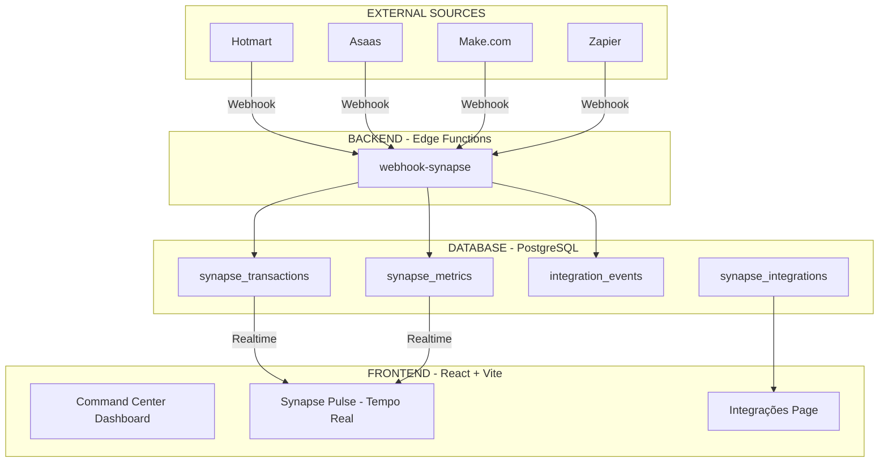

# 🧠 PROJETO SYNAPSE
## Sistema Nervoso Digital - Moisés Medeiros

---

## ARQUITETURA IMPLEMENTADA



---

## O QUE FOI IMPLEMENTADO

### ✅ Banco de Dados (4 novas tabelas)
| Tabela | Descrição |
|--------|-----------|
| `synapse_transactions` | Vendas em tempo real (Hotmart/Asaas) |
| `synapse_metrics` | Métricas diárias agregadas |
| `integration_events` | Log de todos os webhooks recebidos |
| `synapse_integrations` | Configurações das integrações |

### ✅ Edge Function (webhook-synapse)
- Recebe webhooks de Hotmart, Asaas, Make.com
- Auto-detecta fonte pelo header ou payload
- Salva transações e atualiza métricas
- URL: `https://fyikfsasudgzsjmumdlw.supabase.co/functions/v1/webhook-synapse`

### ✅ Componentes do Dashboard
- **SynapsePulse** - Receita em tempo real com animações
- **SynapseCommandCenter** - Visão da arquitetura
- **SynapseIntegrations** - Gerenciador de conexões

### ✅ Página de Integrações
- Configuração visual de webhooks
- Logs em tempo real
- Instruções de setup

---

## COMO CONFIGURAR

### Hotmart
```
URL: https://fyikfsasudgzsjmumdlw.supabase.co/functions/v1/webhook-synapse?source=hotmart
Eventos: PURCHASE_APPROVED, PURCHASE_REFUNDED
```

### Asaas
```
URL: https://fyikfsasudgzsjmumdlw.supabase.co/functions/v1/webhook-synapse?source=asaas
Eventos: PAYMENT_RECEIVED, PAYMENT_CONFIRMED
```

### Make.com / Zapier
```
URL: https://fyikfsasudgzsjmumdlw.supabase.co/functions/v1/webhook-synapse?source=make
Formato: JSON com campos amount, customer_name, product
```

---

## EMPRESAS CONFIGURADAS

| Razão Social | CNPJ |
|-------------|------|
| MM CURSO DE QUÍMICA LTDA | 53.829.761/0001-17 |
| CURSO DE QUÍMICA MOISES MEDEIROS LTDA | 44.979.308/0001-04 |

---

## PRÓXIMAS EXPANSÕES OPCIONAIS

1. **Email Notifications** - Requer RESEND_API_KEY
2. **Google Analytics API** - Métricas de tráfego
3. **YouTube API** - Estatísticas de vídeos
4. **AI Insights** - Previsão de faturamento

---

*PROJETO SYNAPSE v1.0 - Sistema Nervoso Digital*
*Desenvolvido para Moisés Medeiros*
